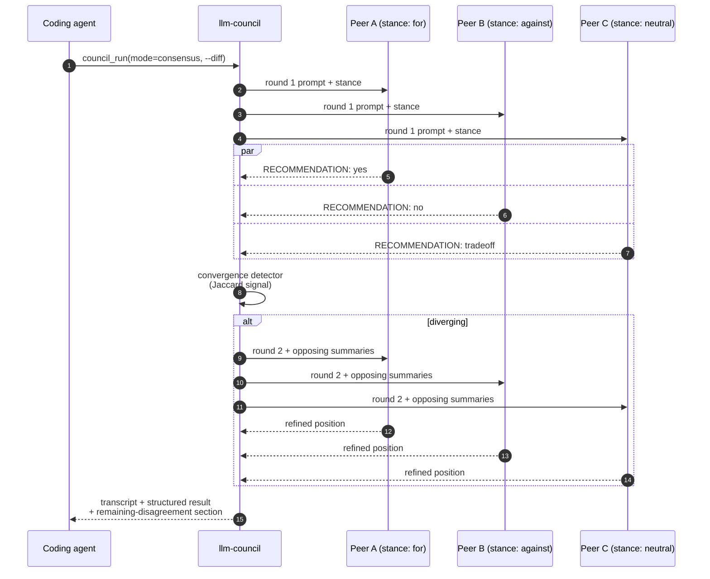

# LLM Council

[](https://github.com/Intellimetrics/llm-council/actions/workflows/test.yml)
[](pyproject.toml)
[](docs/llm-council.md)
[](#costs-data-boundaries-safety)
[](LICENSE)
[](https://github.com/Intellimetrics/llm-council/stargazers)
[](CHANGELOG.md)

> **Your coding agent is confident. It is not always right.**

LLM Council is a read-only panel of peer reviewers for whichever coding agent
you already use. One MCP server, three native CLIs (Claude Code, Codex CLI,
Gemini CLI), plus any OpenRouter or local Ollama model. Your agent says
*"ask council"*. They look at the same diff in parallel. They disagree. You
get a transcript with `RECOMMENDATION: yes | no | tradeoff` from each —
machine-readable, so the agent that called the council knows what to do
with the answer.

They never edit your code. Read-only is the load-bearing invariant: every
CLI peer launches under its host's safety flags (`--permission-mode default`
for Claude, `--sandbox read-only` for Codex, `--approval-mode plan` for
Gemini), and any reply that doesn't carry a `RECOMMENDATION:` label is
treated as a failed response, not a silent pass.

```text
   Convening llm-council starting: mode=consensus, current=codex, participants=claude, codex, gemini
      claude start round 1
       codex start round 1
      gemini start round 1
      claude ok round 1 (1432 tokens; $0.00867)
       codex ok round 1 (1581 tokens; $0.00951)
      gemini ok round 1 (1290 tokens; $0.00774)
Deliberating disagreement detected; starting round 2
       Round 2 (deliberation)
      gemini ok round 2 (1104 tokens; $0.00662)
       codex ok round 2 (1221 tokens; $0.00734)
      claude ok round 2 (996 tokens; $0.00598)
   Concluded llm-council complete: 3/3 participants succeeded
             ────────────
  Transcript .llm-council/runs/20260503_142701_review_consensus.md
```

The right-aligned gutter is the layout, not the color. `NO_COLOR=1` and CI
piping strip the ANSI but keep the alignment, so a council run stays
scannable in build logs.

---

## Quickstart

```bash
uv tool install --force git+https://github.com/Intellimetrics/llm-council.git
cd /path/to/your/project
llm-council setup --plan
llm-council setup --yes --preset auto
llm-council doctor
```

No `uv`? Use `pipx install --force git+https://...` — same path.
(Don't use `uvx` for the install — it re-resolves on every call and writes
no project config.) Restart your coding agent and ask it plainly:

```text
Ask council to review the current diff before we ship it.
```

If `setup --plan` finds fewer than two routes, you'll need a second account
or `OPENROUTER_API_KEY` set — council needs at least two voices to be a
council.

> [!TIP]
> For a real project use the [agent-driven install](#agent-driven-install)
> at the bottom — it appends the routing rules to your `CLAUDE.md` /
> `AGENTS.md` / `GEMINI.md`, which is the step that turns *"council is
> installed"* into *"the agent actually knows when to call it."*

---

## What you can ask council

You talk to your agent. The agent calls council when one of these phrases
shows up.

| Say this | What runs | When to reach for it |
|---|---|---|
| *"Take this stubborn bug to council. I want independent theories."* | mode=`quick` | Your agent has been wrong about the same bug twice. Different families, different blind spots. |
| *"Run a `consensus` review on the current diff before we ship."* | mode=`consensus`, `--diff` | Release-gate review. Peers get assigned for/against/neutral stances; disagreement triggers a second round. |
| *"Ask cheap council whether this even needs a frontier review."* | mode=`review-cheap` | Triage before spending real money. Routes to budget hosted models. |
| *"Use private council — this diff can't leave the box."* | mode=`private-local` | Local Ollama only, no hosted calls. |
| *"Estimate council cost on this diff first."* | `council_estimate` | Pre-flight token + dollar estimate before a real run. |

Council feedback is advisory. Whether to act on it is up to your agent and
you.

---

## Pick your council

| If you have… | Choose preset | Best for |
|---|---|---|
| One coding CLI | `openrouter` | Adding outside model opinions with one API key |
| Two or more native CLIs | `auto` | Using accounts you already have |
| Native CLIs plus hosted models | `tri-cli-openrouter` | Stronger diversity and frontier escalation |
| Local-only | `local-private` | Offline / private review through Ollama |

`setup` refuses to write a preset whose required CLIs or API keys are
missing. Pass `--allow-incomplete` only when you deliberately want the
config in place before the dependencies arrive.

---

## Modes

| Mode | Behavior |
|---|---|
| `quick` | Fast peer review, three CLIs, one round |
| `peer-only` | Excludes the current host CLI; outside opinions only |
| `plan` | Architecture-leaning, longer timeouts |
| `review` | Diff-focused; pairs well with `--diff` |
| `review-cheap` | Same shape as `review` but routes to budget hosted models |
| `diverse` | Spans Claude / Codex / Gemini / OpenRouter for max diversity |
| `private-local` | Ollama-only, no hosted calls |
| `us-only` | Filters to US-origin participants |
| `deliberate` | Forces a deliberation round even on agreement |
| `consensus` | Assigned `for` / `against` / `neutral` stances + deliberation |

Define your own under `modes:` in `.llm-council.yaml`. See the
[operator reference](docs/llm-council.md) for the schema.

---

## Consensus, the mode that makes this worth installing

Most multi-LLM tools agree by averaging. `consensus` disagrees on purpose.
Three peers get assigned `for`, `against`, and `neutral` stances on the
question. A convergence detector (Jaccard signal on response content)
decides whether they actually moved after round 1; if not, round 2 forces
them to read each other's opposing summaries and refine.



An ethical-override clause lets a stance-assigned peer break stance when
the assigned position would be unsafe to defend — so the `against` peer
doesn't have to argue for shipping a backdoor just to honor its
assignment. If the council never converges, the transcript carries an
explicit *Remaining disagreement* section your agent can branch on instead
of pretending agreement that didn't happen.

---

## Tier selection

Same council, different model behind each peer. Pin a `deep` (top-end
thinking) and `fast` (budget) tier in `.llm-council.yaml`:

```yaml
defaults:
  tiers:
    deep:
      claude: anthropic/claude-opus-4
      codex:  openai/o1-pro
      gemini: google/gemini-2.5-pro-thinking
    fast:
      claude: anthropic/claude-haiku-4-5
      codex:  openai/gpt-4o-mini
      gemini: google/gemini-2.5-flash
```

Then pick a tier per run:

```bash
llm-council run --tier deep --diff "Is this auth migration safe?"
llm-council run --tier fast --mode quick "what does this module export?"
```

Peers absent from the tier map keep their default. A typo in the tier name
fails the run with the list of configured tiers — no silent fall-through.
`council_run` accepts the same `tier` argument over MCP, so an agent can
ask *"use council with the deep tier"* and the swap happens transparently.

---

## Costs, data boundaries, safety

Council can call three kinds of participant:

- **Native CLI peers** use your installed Claude Code, Codex CLI, or
  Gemini CLI account. Billing and limits are theirs.
- **OpenRouter peers** are hosted API calls billed by token.
- **Ollama peers** run locally on your machine.

Pre-flight cost gates:

```bash
llm-council run --mode consensus --diff --max-cost-usd 0.50 --max-tokens 200000 \
  "Is this migration safe to ship?"
```

`--max-cost-usd` and `--max-tokens` refuse the run on the **estimate**
before any subprocess or HTTP call. Free/local peers count as $0;
uncatalogued hosted peers refuse the run rather than passing the cap
silently. `llm-council estimate ...` gives a per-peer breakdown when a cap
fails.

Read-only invariants worth knowing:

- Every CLI peer launches under its host's read-only permission flags.
- Output without a `RECOMMENDATION:` label is rejected.
- The MCP server is scoped to the configured project root.
- `.mcp.json` does not embed API keys; secrets live in `.env`,
  `.env.local`, or `.llm-council.env` (which overrides shell env so an
  MCP-host shell can't shadow your project key).
- Prompt-size guards refuse oversized prompts before any subprocess
  launches.
- Per-participant context-window budgets gracefully exclude peers that
  can't fit the prompt rather than failing the whole council.

> [!CAUTION]
> Do not use council for classified, CUI, regulated, customer, production,
> credential, or `DEPLOY_MODE=secret` content unless every configured
> participant is approved for that data. US-origin model/company origin is
> not the same as GovCloud, FedRAMP, or enterprise data-handling approval.

---

## MCP tools

The generated `.mcp.json` exposes an MCP server named `llm-council`:

| Tool | Purpose |
|---|---|
| `council_run` | Ask the configured council a question (returns structured result) |
| `council_estimate` | Estimate prompt size and hosted cost before a run |
| `council_recommend` | Ask whether council is worth using for a task |
| `council_doctor` | Check setup, version, and optional update status |
| `council_list_modes` | Inspect configured modes and participants |
| `council_last_transcript` | Fetch the latest transcript path or content |
| `council_models` | Inspect configured or hosted model choices |
| `council_stats` | Aggregate transcript stats over a time window |

`council_run` advertises an `outputSchema` and emits matching
`structuredContent`, so strict MCP clients can branch on the typed result
without parsing free-form text. Per-participant progress streams back in
`metadata.progress_events`.

---

## Agent-driven install

Most users shouldn't run `llm-council` by hand. Open the project where
you want council, then paste this into your active coding agent:

<details>
<summary><b>The full install prompt</b></summary>

```text
Install LLM Council into this project from
https://github.com/Intellimetrics/llm-council.

Use the agent-first install path:
1. Check for `uv` with `command -v uv`. If present, run:
   `uv tool install --force git+https://github.com/Intellimetrics/llm-council.git`
2. If `uv` is not installed, check for `pipx`. If present, run:
   `pipx install --force git+https://github.com/Intellimetrics/llm-council.git`
3. Do not use `uvx`; this must be a stable project install.
4. From this project root, run `llm-council setup --plan`.
5. Show me the detected routes and ask which preset I want: `auto`,
   `tri-cli`, `openrouter`, `tri-cli-openrouter`, `local-private`, or
   `all`. Do not choose silently unless I explicitly say to use the
   recommendation.
6. Run `llm-council setup --yes --preset <my-choice>`.
7. If setup reports no usable council route, stop and ask me whether to
   set `OPENROUTER_API_KEY` or install another native CLI.
8. After setup, append the snippet from `.llm-council/instructions/` to
   the correct project instruction file without overwriting:
   - Claude Code:  `.llm-council/instructions/claude.md`  -> `CLAUDE.md`
   - Codex CLI:    `.llm-council/instructions/codex.md`   -> `AGENTS.md`
   - Gemini CLI:   `.llm-council/instructions/gemini.md`  -> `GEMINI.md`
9. Confirm the destination file now contains the LLM Council routing
   rules.
10. Run `llm-council doctor` and show me the result.
11. Tell me to restart this CLI session so MCP and project instructions
    reload.
```

</details>

This covers the steps agents skip on their own: using `uvx` instead of a
stable install, copying placeholder paths into `.mcp.json`, overwriting
existing project instructions, accepting the wrong preset silently,
forgetting the instruction-file append, or declaring success before
`doctor` passes.

---

## Manual terminal use

For setup, diagnostics, transcripts, and the occasional direct run.

```bash
llm-council setup --plan
llm-council doctor [--probe-openrouter] [--probe-ollama] [--check-update]
llm-council models refresh                   # force-fetch the OpenRouter catalog
llm-council run --current codex --mode review --diff "Review this change"

llm-council last
llm-council transcripts list
llm-council transcripts summary
llm-council transcripts prune --keep-since 2026-04-01 --apply
```

Conversation threading via `--continue <run_id>` and chunking via
`--chunk-strategy {head|tail|hash-aware}` are documented in the
[operator reference](docs/llm-council.md).

---

## Try it without installing

```bash
uvx --from git+https://github.com/Intellimetrics/llm-council.git llm-council \
    run --mode quick "explain why this codebase chose option X over option Y"
```

`uvx` writes nothing to disk and gives your coding agent no MCP access.
Useful for kicking the tires from a clean shell — not the install.

---

## Smithery

The repo ships a [`smithery.yaml`](smithery.yaml) that registers
`llm-council mcp-server` as a stdio MCP server. Install from the
Smithery marketplace UI; the manifest's `configSchema` exposes
`OPENROUTER_API_KEY`, `OLLAMA_HOST`, and `LLM_COUNCIL_MCP_ROOT`
overrides. Native CLI peers still need to be installed on the host
separately.

---

## Update

```bash
llm-council --version
llm-council check-update
uv tool install --force git+https://github.com/Intellimetrics/llm-council.git
```

`llm-council run` quietly checks for a newer release once every 24 hours
and prints a single stderr line when one is available. Set
`LLM_COUNCIL_NO_UPDATE_CHECK=1` to silence it. Releases are tagged
`vX.Y.Z` and recorded in [CHANGELOG.md](CHANGELOG.md).

---

## More

- [Operator reference](docs/llm-council.md) — config, participants,
  costs, MCP details, custom modes
- [Model catalog notes](docs/model-catalog-2026-04-25.md)
- [Refined model evaluation](docs/refined-model-evaluation-2026-04-25.md)
- [Dogfood issues](docs/dogfood-issues.md) — running log of friction
  surfaced while using llm-council on this repo
- [Changelog](CHANGELOG.md)

---

<sub>MIT licensed. Built for coding agents that want a second opinion before they ship.</sub>
