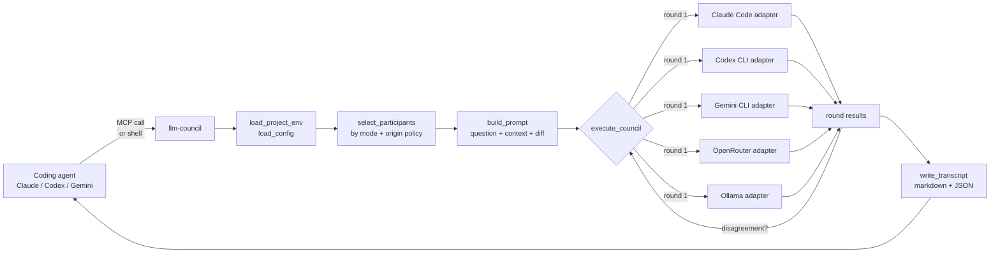
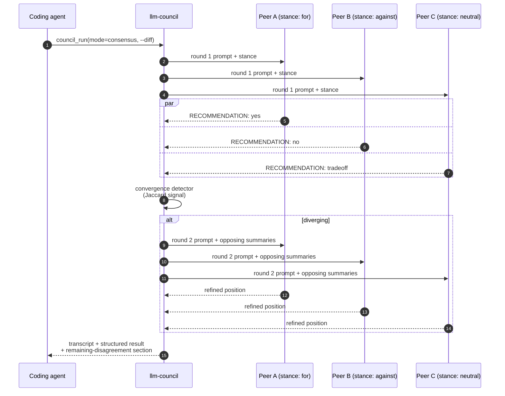

# LLM Council

[](https://github.com/Intellimetrics/llm-council/actions/workflows/test.yml)
[](pyproject.toml)
[](docs/llm-council.md)
[](#safety)
[](LICENSE)
[](https://github.com/Intellimetrics/llm-council/stargazers)
[](CHANGELOG.md)

> **Give your coding agent a council of other models.**
> One MCP server, three native CLIs (Claude Code, Codex CLI, Gemini CLI), plus
> any OpenRouter or Ollama model — all read-only by default, all reviewed in
> parallel, all logged to a local transcript.

```text
   Convening Council starting: mode=consensus, current=codex, participants=claude, codex, gemini
      claude start round 1
       codex start round 1
      gemini start round 1
      claude ok round 1 (1432 tokens; $0.00867)
       codex ok round 1 (1581 tokens; $0.00951)
      gemini ok round 1 (1290 tokens; $0.00774)
Deliberating disagreement detected; starting round 2
       Round 2 (deliberation)
      gemini ok round 2 (1104 tokens; $0.00662)
       codex ok round 2 (1221 tokens; $0.00734)
      claude ok round 2 (996 tokens; $0.00598)
   Concluded Council complete: 3/3 participants succeeded
             ────────────
  Transcript .llm-council/runs/20260503_142701_review_consensus.md
```

A right-aligned bold-cyan gutter (verb on orchestrator lines, peer name
on per-participant lines) gives council its visual identity. The
*layout* is the signature, not the color — `NO_COLOR=1` and piped
contexts strip the ANSI but keep the right-alignment, so council output
stays scannable in CI logs too. Status words inside the content are
colored separately: `ok` green, `timeout` yellow, `failed` / `error` red.

---

## Table of contents

- [Why use it](#why-use-it)
- [How it works](#how-it-works)
- [Install](#install)
- [Use it from your agent](#use-it-from-your-agent)
- [Pick your council](#pick-your-council)
- [Modes](#modes)
- [Tier selection](#tier-selection)
- [Consensus mode at a glance](#consensus-mode-at-a-glance)
- [Costs and data boundaries](#costs-and-data-boundaries)
- [What setup creates](#what-setup-creates)
- [Manual terminal use](#manual-terminal-use)
- [MCP tools](#mcp-tools)
- [Safety](#safety)
- [Update](#update)
- [More](#more)

---

## Why use it

Single-agent coding is fast, but it is also easy for one model to overfit its
own plan. LLM Council gives your agent a lightweight way to ask independent
reviewers for:

- architecture pushback before a big implementation
- security and data-handling review before touching sensitive paths
- second opinions on stubborn bugs
- release-gate review of a diff
- model diversity when one agent keeps looping
- local/private review through Ollama when hosted calls are not appropriate

Council participants are **advisory and read-only by default** — they analyze,
they do not edit.

> [!TIP]
> The fastest way to feel the value: run a `consensus` review on your next
> non-trivial diff. Three peers with assigned for/against/neutral stances
> almost always surface at least one bug or risk a single reviewer misses.

---

## How it works

When you say "ask council" inside your coding agent, the request flows through
a single pipeline whether it arrives via MCP or the CLI:



Two surfaces share that pipeline:

- **MCP server** (`llm-council mcp-server`) — exposes `council_run`,
  `council_estimate`, `council_recommend`, `council_doctor`, and friends to
  any MCP-capable host.
- **CLI** (`llm-council run ...`) — same orchestrator, same transcripts,
  useful for one-off queries, scripting, and CI.

Read-only enforcement lives in each adapter's per-CLI args
(`--permission-mode default` for Claude, `--sandbox read-only` for Codex,
`--approval-mode plan` for Gemini) and in the prompt's `RECOMMENDATION:`
contract — output without a labelled recommendation is treated as a failed
response, not a silent pass.

---

## Install

> [!IMPORTANT]
> Most users should not run `llm-council` by hand. Install it once, then talk
> to your coding agent naturally — "ask council to review this", "take this
> bug to council". The agent owns the loop; council is the second opinion.

### Recommended: agent-driven install

Open the project where you want council installed, then paste this into your
active coding agent:

<details>
<summary><b>Click to expand the agent install prompt</b></summary>

```text
Install LLM Council into this project from
https://github.com/Intellimetrics/llm-council.

Use the agent-first install path:
1. Check for `uv` with `command -v uv`. If present, run:
   `uv tool install --force git+https://github.com/Intellimetrics/llm-council.git`
2. If `uv` is not installed, check for `pipx` with `command -v pipx`. If
   present, run:
   `pipx install --force git+https://github.com/Intellimetrics/llm-council.git`
3. Do not use `uvx`; this must be a stable project install.
4. From this project root, run `llm-council setup --plan`.
5. Show me the detected routes and ask which preset I want: `auto`,
   `tri-cli`, `openrouter`, `tri-cli-openrouter`, `local-private`, or `all`.
   Do not choose silently unless I explicitly say to use the recommendation.
6. Run `llm-council setup --yes --preset <my-choice>`.
7. If setup reports no usable council route, stop and ask me whether to set
   `OPENROUTER_API_KEY` or install another native CLI.
8. After setup, read the generated snippet for this CLI from
   `.llm-council/instructions/`, then append that file's full contents to
   the correct project instruction file without overwriting existing
   content:
   - Claude Code:  `.llm-council/instructions/claude.md`  -> `CLAUDE.md`
   - Codex CLI:    `.llm-council/instructions/codex.md`   -> `AGENTS.md`
   - Gemini CLI:   `.llm-council/instructions/gemini.md`  -> `GEMINI.md`
9. Confirm the destination file now contains the LLM Council routing rules.
10. Run `llm-council doctor` and show me the result.
11. Tell me to restart this CLI session so MCP and project instructions
    reload.
```

</details>

This avoids the common mistakes agents make: using `uvx`, copying placeholder
paths into `.mcp.json`, overwriting existing project instructions, silently
accepting the wrong preset, skipping the instruction-file append step, or
declaring success before `doctor` passes.

### Try without installing

If you only want to kick the tires before deciding whether to install
project-wide, you can run a one-shot via `uvx` without committing anything to
disk:

```bash
uvx --from git+https://github.com/Intellimetrics/llm-council.git llm-council \
    run --mode quick "explain why this codebase chose option X over option Y"
```

> [!WARNING]
> `uvx` re-resolves and re-installs on every invocation, no project config
> (`.llm-council.yaml` / `.mcp.json`) is written, and your coding agent will
> not get MCP-level access to the council. Use this for exploration only —
> the [agent-driven install](#recommended-agent-driven-install) is the right
> choice for any real project.

### Smithery-aware MCP hosts

The repo ships a [`smithery.yaml`](smithery.yaml) that registers
`llm-council mcp-server` as a stdio MCP server. Install it from the Smithery
marketplace UI in your host of choice; the manifest's `configSchema` exposes
optional `OPENROUTER_API_KEY`, `OLLAMA_HOST`, and `LLM_COUNCIL_MCP_ROOT`
overrides. Native CLI peers (Claude Code, Codex CLI, Gemini CLI) still need
to be installed on the host separately.

---

## Use it from your agent

Restart your coding agent after install, then talk naturally:

```text
Use council to review this plan before implementing it.
```

```text
Ask council whether this database migration is safe. Include the current diff.
```

```text
Take this bug to council. I want independent theories before we change code.
```

```text
Use cheap council first, then tell me whether this is worth a frontier review.
```

The generated project instructions teach your agent the routing rules:

- `go to council`, `ask council`, or `use council` calls `council_run`
- the active CLI passes its identity, so transcripts show which host will
  synthesize and act
- `quick` asks Claude, Codex, and Gemini as explicit read-only participants
- `peer-only` excludes the current host subprocess when you only want outside
  perspectives
- `on the diff` includes the current git diff
- `cheap` uses budget hosted reviewers
- `private` or `local` uses the local Ollama route
- council feedback is advisory unless you explicitly ask the agent to act

---

## Pick your council

| If you have... | Choose... | Best for... |
| --- | --- | --- |
| One coding CLI | `openrouter` | adding outside model opinions with one API key |
| Two or more of Claude Code, Codex CLI, Gemini CLI | `auto` | using accounts you already have |
| Native CLIs plus hosted models | `tri-cli-openrouter` | stronger diversity and frontier escalation |
| Local models through Ollama | `local-private` | private/offline review |

`llm-council setup --plan` first, then `llm-council setup --yes --preset <choice>`.
Auto picks a route only when at least two native CLIs are present, or when
`OPENROUTER_API_KEY` is set. If you only have one CLI account, OpenRouter is
usually the easiest way to add outside reviewers.

> [!NOTE]
> Setup refuses to write a preset whose required CLIs or API keys are
> missing — pass `--allow-incomplete` only when you deliberately want the
> config in place before installing the dependencies.

---

## Modes

<details>
<summary><b>Click to see all built-in modes</b></summary>

| Mode | Behavior |
| --- | --- |
| `quick` | Fast peer review, three CLIs, one round |
| `peer-only` | Excludes the current host CLI; outside opinions only |
| `plan` | Architecture-leaning prompts, longer timeouts |
| `review` | Diff-focused review; pairs well with `--diff` |
| `review-cheap` | Same shape as `review` but routes to budget hosted models |
| `diverse` | Spans Claude / Codex / Gemini / OpenRouter for max model diversity |
| `private-local` | Ollama-only; no hosted calls |
| `us-only` | Filters to US-origin participants |
| `deliberate` | Forces a deliberation round even on agreement |
| `consensus` | Assigned `for` / `against` / `neutral` stances + deliberation |
| `opus-versions` | Compares Claude Opus 4.6 and 4.7 head to head |

</details>

Add your own in `.llm-council.yaml` under `modes:`. See the
[operator reference](docs/llm-council.md) for the schema.

---

## Tier selection

Swap the model each peer uses without rewriting your config. Pin a `deep`
(top-end thinking) and `fast` (budget) tier in `.llm-council.yaml`:

```yaml
defaults:
  tiers:
    deep:
      claude: anthropic/claude-opus-4
      codex:  openai/o1-pro
      gemini: google/gemini-2.5-pro-thinking
    fast:
      claude: anthropic/claude-haiku-4-5
      codex:  openai/gpt-4o-mini
      gemini: google/gemini-2.5-flash
```

Then pick a tier per run:

```bash
llm-council run --tier deep --diff "Is this auth migration safe?"
llm-council run --tier fast --mode quick "summarize what this module exports"
```

> [!NOTE]
> Peers absent from the tier map keep their default model, so a tier can
> swap a subset without redeclaring the whole council. A typo in the tier
> name fails the run with the list of configured tiers — no silent
> fall-through.

`council_run` accepts the same `tier` argument over MCP, so your coding
agent can ask "use council with the deep tier" and the swap happens
transparently.

---

## Consensus mode at a glance

`consensus` is the high-leverage mode for release-gate review: peers are
assigned opposing stances, the council deliberates after round 1, and
disagreement that doesn't converge is surfaced explicitly in the transcript.



The `RECOMMENDATION: yes|no|tradeoff` label on every peer reply makes the
result machine-readable, and an ethical-override clause lets a stance-assigned
peer break stance when an assigned position would be unsafe to defend.

---

## Costs and data boundaries

Council can call different kinds of participants:

- **Native CLI participants** use your installed Claude Code, Codex CLI, or
  Gemini CLI account. Billing and limits are controlled by those tools.
- **OpenRouter participants** are hosted API calls billed by token. Run an
  estimate before expensive reviews.
- **Ollama participants** run locally on your machine.

Ask your agent:

```text
Estimate the council cost for reviewing the current diff before running it.
```

Or run directly:

```bash
llm-council estimate --mode review-cheap --diff "Review this change"
```

Run-level guardrails:

```bash
llm-council run --mode consensus --diff --max-cost-usd 0.50 --max-tokens 200000 \
  "Is this migration safe to ship?"
```

`--max-cost-usd` and `--max-tokens` gate the run on the **pre-flight estimate**
before any subprocess or HTTP call — so a misconfigured peer can't surprise you
with real spend. Free/local peers count as $0; uncatalogued hosted peers refuse
the run rather than silently passing the cap.

> [!CAUTION]
> Do not use council for classified, CUI, regulated, customer, production,
> credential, or `DEPLOY_MODE=secret` content unless every configured
> participant is approved for that data. US-origin model/company origin is
> not the same as GovCloud, FedRAMP, or enterprise data-handling approval.

---

## What setup creates

```text
.llm-council.yaml                  shared project council config
.mcp.json                          local MCP command and project path
.llm-council/instructions/*.md     snippets to append to agent instructions
.llm-council/runs/                 local transcripts (markdown + JSON)
```

> [!NOTE]
> `.mcp.json` contains absolute paths for one machine. Setup adds it to
> `.gitignore`. Commit `.llm-council.yaml` only if your team wants shared
> council modes; each developer should run setup locally.

If `.mcp.json` was already committed:

```bash
git rm --cached .mcp.json
```

---

## Manual terminal use

Most users will interact through their coding agent. The terminal command is
still useful for setup, diagnostics, transcripts, and occasional direct runs.

```bash
uv tool install --force git+https://github.com/Intellimetrics/llm-council.git
cd /path/to/project
llm-council setup --plan
llm-council setup --yes --preset <chosen-preset>
llm-council doctor                    # also checks OpenRouter catalog age
llm-council models refresh            # force-fetch the OpenRouter catalog
llm-council check-update
```

Direct review:

```bash
llm-council run --current codex --mode review --diff "Review this change"
```

Transcript tools:

```bash
llm-council last
llm-council transcripts list
llm-council transcripts summary
llm-council transcripts prune --keep-since 2026-04-01 --apply
```

Conversation threading via `--continue <run_id>` and chunking via
`--chunk-strategy {head|tail|hash-aware}` are documented in the
[operator reference](docs/llm-council.md).

---

## MCP tools

The generated `.mcp.json` exposes an MCP server named `llm-council`:

| Tool | Purpose |
| --- | --- |
| `council_run` | Ask the configured council a question (returns structured result) |
| `council_estimate` | Estimate prompt size and hosted cost before a run |
| `council_recommend` | Ask whether council is worth using for a task |
| `council_doctor` | Check setup, version, and optional update status |
| `council_list_modes` | Inspect configured modes and participants |
| `council_last_transcript` | Fetch the latest transcript path or content |
| `council_models` | Inspect configured or hosted model choices |
| `council_stats` | Aggregate transcript stats over a time window |

MCP calls return participant progress in `metadata.progress_events` when the
tool call completes. `council_run` advertises an `outputSchema` and emits
matching `structuredContent`, so strict MCP clients can branch on the typed
result without parsing free-form text.

---

## Safety

- Council participants are instructed to be read-only.
- The MCP server is scoped to the configured project root.
- Generated MCP config does not embed API keys.
- Secrets can live in `.env`, `.env.local`, or `.llm-council.env`. The
  project-specific `.llm-council.env` overrides the shell environment so
  MCP-host shells can't shadow your project key.
- Prompt-size guards refuse oversized prompts before any subprocess launches
  rather than silently truncating them.
- Hosted model calls are explicit through your config and provider keys.
- Per-participant context-window budgets gracefully exclude peers that can't
  fit the prompt rather than failing the whole council.

---

## Update

```bash
llm-council --version
llm-council check-update
uv tool install --force git+https://github.com/Intellimetrics/llm-council.git
```

> [!TIP]
> `llm-council run` quietly checks for a newer release once every 24 hours
> and prints a single stderr line when one is available. Set
> `LLM_COUNCIL_NO_UPDATE_CHECK=1` to silence it.

Releases are tagged as `vX.Y.Z` and recorded in [CHANGELOG.md](CHANGELOG.md).

---

## More

- [Operator reference](docs/llm-council.md) — config, participants, costs, MCP
  details, and custom modes.
- [Model catalog notes](docs/model-catalog-2026-04-25.md) — model selection
  context from the initial release.
- [Refined model evaluation](docs/refined-model-evaluation-2026-04-25.md) —
  followup notes on which routes proved most useful in practice.
- [Dogfood issues](docs/dogfood-issues.md) — running log of friction surfaced
  while using llm-council on this repo.
- [Changelog](CHANGELOG.md) — release history.

---

<sub>Built for coding agents that want a second opinion before they ship.
MIT licensed.</sub>
