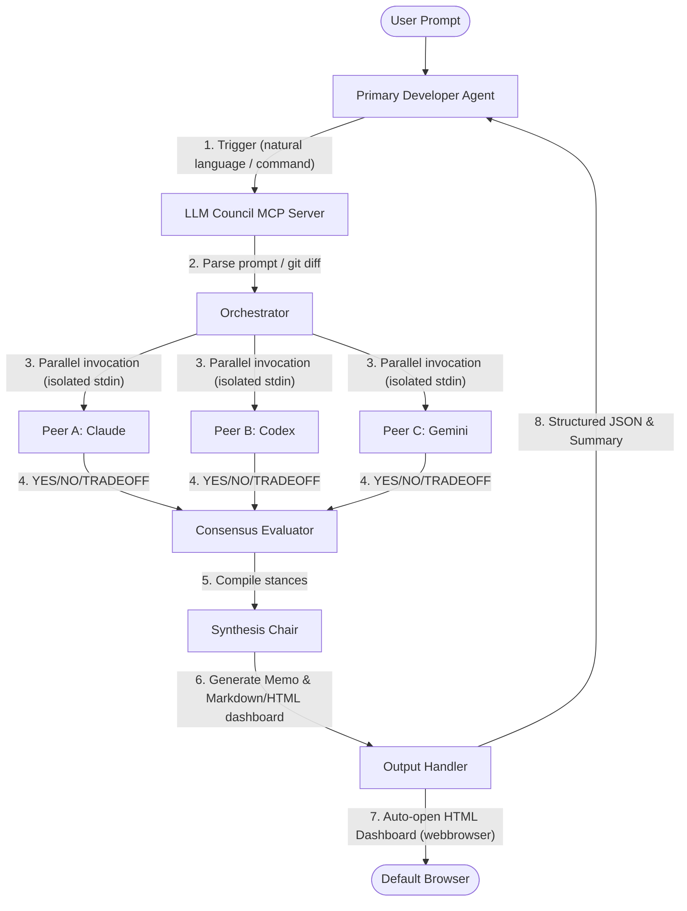

# LLM Council

[](https://github.com/Intellimetrics/llm-council/actions/workflows/test.yml)
[](pyproject.toml)
[](docs/llm-council.md)
[](#read-only-safety)
[](LICENSE)
[](CHANGELOG.md)

Your coding agent is incredibly fast, capable, and confident. 

That is highly valuable—until it confidently overwrites a critical database migration, introduces a subtle security vulnerability, or refactors a complex module it wasn't supposed to touch.

**LLM Council** is a lightweight, read-only multi-agent orchestration harness designed to give your primary coding agent a fast, independent second opinion before committing to risky changes or expensive edits. It runs as a Python 3.11+ MCP server and command-line tool.

---

## Architecture & Workflow

LLM Council acts as an advisory layer between your primary developer agent (e.g. Claude Code, Codex CLI, Antigravity) and a pool of independent peer review models.


```mermaid
graph TD
    User([User Prompt]) --> Agent[Primary Developer Agent]
    Agent -- "1. Trigger (natural language / command)" --> Server[LLM Council MCP Server]
    Server -- "2. Parse prompt / git diff" --> Orchestrator[Orchestrator]
    Orchestrator -- "3. Parallel invocation (isolated stdin)" --> PeerA[Peer A: Claude]
    Orchestrator -- "3. Parallel invocation (isolated stdin)" --> PeerB[Peer B: Codex]
    Orchestrator -- "3. Parallel invocation (isolated stdin)" --> PeerC[Peer C: Gemini]
    PeerA -- "4. YES/NO/TRADEOFF" --> Consensus[Consensus Evaluator]
    PeerB -- "4. YES/NO/TRADEOFF" --> Consensus
    PeerC -- "4. YES/NO/TRADEOFF" --> Consensus
    Consensus -- "5. Compile stances" --> Synth[Synthesis Chair]
    Synth -- "6. Generate Memo & Markdown/HTML dashboard" --> Out[Output Handler]
    Out -- "7. Auto-open HTML Dashboard (webbrowser)" --> Browser([Default Browser])
    Out -- "8. Structured JSON & Summary" --> Agent
```

---

## Key Features & Capabilities

*   **Consensus Gates & Vote Contracts**: Every peer response is strictly parsed and must resolve to one of three consensus labels. Vague essays are rejected:
    *   `RECOMMENDATION: yes` — Safe to proceed.
    *   `RECOMMENDATION: no` — Stop; major issues detected.
    *   `RECOMMENDATION: tradeoff` — Plausible, but note critical trade-offs.
*   **Assigned-Stance Debates**: Support for multi-round refutation and debates (`consensus` mode) where one peer defends, one opposes, and one remains neutral, followed by a compilation from the **Synthesis Chair**.
*   **Family Exclusion Routing**: Automatically detects the active agent running the session and excludes models from the same family (e.g., Gemini-family) from the peer pool to maximize reviewer diversity.
*   **Rigorous Sandboxing & Read-Only Safety**: Native CLI peers are invoked with binary-level flags disabling file writes (`--permission-mode default` for Claude, `--sandbox read-only` for Codex).
*   **Cost Controls & Caching**: Pre-flight token and USD cost estimation (`llm-council estimate`) plus response caching prevents unexpected hosted API charges.
*   **Credential Secret Scanning**: Scans all prompt content for API keys, tokens, or private keys, with configurable responses (`warn`, `block`, `redact`, or `off`).
*   **Auto-Opening HTML Dashboard**: Automatically generates a beautifully formatted HTML dashboard of the run and opens it in your default web browser upon completion.

---

## Single-Model Peer Isolation

Even if you only have access to a single LLM (due to offline constraints, local setup, or API key limits), running a council session provides substantial value:

1.  **Fresh Eyes / Context Separation**: In a typical developer agent session, the context window accumulates tools, history, and reasoning, leading to confirmation bias. The council calls a fresh, isolated API process containing *only* the diff and prompt, forcing a clean evaluation.
2.  **Persona & State Splitting**: By invoking multiple calls to the same model concurrently with different persona prompts (e.g., Peer A as the *Attacker*, Peer B as the *Defender*, Peer C as the *Judge*), you isolate their states. The model cannot see its own arguments from the other perspective until the synthesis phase.
3.  **Adversarial Extraction**: Forcing the model to adopt contrarian stances (e.g. "Find 3 security flaws in this diff") bypasses its default cooperative/agreeable bias, extracting a deeper critique than a standard prompt.

---

## Installation

Install `llm-council` globally on your system.

### Option A: Using `uv` (Recommended)
```bash
uv tool install --force git+https://github.com/Intellimetrics/llm-council.git
```

### Option B: Using `pipx`
```bash
pipx install --force git+https://github.com/Intellimetrics/llm-council.git
```

> [!WARNING]
> Do not use `uvx` for your primary installation. While convenient for one-off trials, `uvx` does not configure a stable MCP environment or keep the tool persistently available on your path.

---

## Quickstart

Navigate to your active project repository and initialize the council:

```bash
cd /path/to/your/project
llm-council setup --plan
llm-council setup --yes --preset auto
llm-council doctor
```

> [!IMPORTANT]
> After running setup, restart your active terminal session or reload your developer agent so it detects the newly configured MCP server and project-specific instructions.

### The 30-Second Example
Once configured, you can talk to your primary developer agent (e.g., Claude Code, Codex, Antigravity CLI) directly in natural language:

*   *"Ask the council to review my current changes before we commit."*
*   *"Take this failing test to council. I need theory and review, not another patch."*
*   *"Run a local-only council on this code. It cannot leave this machine."*

---

## CLI Reference

While most interaction happens transparently via the MCP server inside your agent, you can invoke the CLI directly:

| Command | Description / Example |
| :--- | :--- |
| **`llm-council run`** | Run a council query. <br>`llm-council run --mode quick "Why is this test flaky?"` |
| **`llm-council run --diff`** | Review the current git diff. <br>`llm-council run --mode review --diff "Is this migration safe to run?"` |
| **`llm-council run --focus`** | Compose operator-authored review-focus bundles onto any mode (comma-separated). <br>`llm-council run --mode review --focus security-review,test-gaps --diff "Safe to merge?"` |
| **`llm-council run --acceptance-contract`** | Anchor review on stated acceptance criteria (advisory). Pass literal text or a file path inside cwd; a finding blocks only when it violates a numbered criterion. <br>`llm-council run --mode review --acceptance-contract ./CRITERIA.md --diff "Does this meet the contract?"` |
| **`llm-council run --independent-review`** | On a `--continue` run, suppress the prior council's verdicts/rationales so the round forms its opinion independently. <br>`llm-council run --mode review --continue 20260101_120000 --independent-review --diff "Re-review"` |
| **`llm-council estimate`** | Calculate prompt size and costs before running. <br>`llm-council estimate --mode consensus --diff "Should we merge this?"` |
| **`llm-council last`** | Inspect the last run's raw transcripts. <br>`llm-council last` |
| **`llm-council config get`** | Retrieve a configuration value. <br>`llm-council config get defaults.auto_open_browser` |
| **`llm-council config set`** | Set a configuration value. <br>`llm-council config set defaults.auto_open_browser true` |

---

## MCP Server Integration

The `llm-council` server exposes the following tools to your developer agents:

| MCP Tool Name | Description / Inputs |
| :--- | :--- |
| **`council_run`** | Run a council query with custom modes, context files, and optional diffs. Supports `open: true` to auto-launch the HTML dashboard, `focus: ["security-review", ...]` to compose review-focus bundles, `acceptance_contract: "<text or path>"` to gate blockers on numbered criteria, and `independent_review: true` to suppress prior-council context on a continuation run. |
| **`council_estimate`** | Check token sizes and estimated OpenRouter cost before launching. |
| **`council_recommend`** | Evaluates a task, risk level, and files touched to recommend whether to consult the council. |
| **`council_doctor`** | Diagnoses connection issues, API key status, and CLI path resolution. |
| **`council_list_modes`** | Lists configured modes, presets, and active peers. |
| **`council_last_transcript`** | Returns the path and content of the last recorded run. |
| **`council_stats`** | Aggregates participant metrics (run count, success, tokens, cost) across recorded transcripts. |
| **`council_query_transcripts`** | Searches past transcript history for similar reviews. |
| **`council_config`** | Get or set configuration keys in `.llm-council.yaml` programmatically via the MCP connection. |

---

## Presets & Configuration

The setup wizard (`llm-council setup --plan`) automatically probes your environment to find available tools and recommends the best preset:

| Preset | Description / Use Case |
| :--- | :--- |
| `auto` | Automatically selects the best mix of local CLIs, hosted keys, and local models. |
| `tri-cli` | Resolves a local 3-member triad (Claude Code, Codex CLI, and Antigravity CLI or Gemini CLI). |
| `openrouter` | Uses hosted API models through a single OpenRouter key. |
| `tri-cli-openrouter` | Runs local CLIs with hosted fallback or additional variety. |
| `local-private` | Strict offline-only review using local Ollama instances. |
| `all` | Configures every discovered route on the host machine. |

Custom presets, modes, and default options can be configured directly in `.llm-council.yaml`.

---

## Read-Only Safety

Peers act strictly as advisors, not co-authors. How strongly that's enforced differs by peer type — know the difference before reviewing untrusted code:

*   **Flag-enforced (hard) — `claude`, `codex`, `gemini`**: invoked with flags that disable their write tools at the CLI level (`--permission-mode default` for Claude, `--sandbox read-only` for Codex, `--approval-mode plan` for Gemini). A misbehaving model — or a prompt-injected diff — *cannot* write files.
*   **Hosted & local models** (OpenRouter / Ollama): plain API calls with no filesystem access at all — inherently read-only.
*   **Prompt-enforced (soft) — `antigravity` (`agy`)**: `agy` exposes no read-only / approval-mode / tools-allowlist flag, and its `--sandbox` only restricts the *terminal*, not the model's native file-write tool — so `agy` *can* write files. Its read-only behavior is carried by the council prompt's read-only directive, which `agy` reliably honors (it refuses write requests). `--dangerously-skip-permissions` is deliberately **omitted** so a stray write isn't auto-approved. This is a **softer** guarantee than the flag-enforced peers: a determined prompt-injection in reviewed content could in principle override the directive with no hard backstop. If you review untrusted code, prefer `gemini` (hard) over `antigravity`.
*   **Stdin isolation**: peers receive the codebase or diff via standard input.

---

## Review Focus Bundles

Operator-authored "review focus" bundles let you express *what* a council should scrutinize without editing source. A bundle composes onto **any** mode and is **inert prompt text only** — it shapes the review angle but grants **no tool, write, or exec capability**. It rides on top of the same read-only guarantees described above.

**Layout** — drop a bundle under your project's `.llm-council/` directory (discovery walks up from cwd, first match wins, exactly like config discovery):

```
.llm-council/review-skills/<name>/SKILL.md
```

Each `SKILL.md` is YAML-ish frontmatter (`name:` + `description:`) followed by a markdown body of read-only scrutiny directives:

```markdown
---
name: security-review
description: Read-only security scrutiny lens.
---
Scrutinize for authz/authn gaps, injection, secrets in code, unsafe
deserialization. Cite file:line. Do not propose edits, only flag.
```

**Usage** — name one or more bundles; they compose with the active mode and persist across deliberation rounds:

```bash
llm-council run --mode review --focus security-review,test-gaps --diff "Safe to merge?"
```

MCP equivalent: pass `"focus": ["security-review", "test-gaps"]` to `council_run`.

**Validation & discovery semantics**:

*   **Strict names**: `name` must match `^[a-z0-9-]+$`, be ≤ 64 chars, and equal the directory name.
*   **Lenient discovery**: a malformed bundle is *skipped* (with a reason), never fatal — one bad bundle can't break a run. The CLI prints a one-line warning naming skipped bundles.
*   **Fail fast on typos**: an unknown `--focus` name aborts the run with the list of available bundles **before any peer is launched**.
*   **Provenance (M11)**: applied bundles are recorded in the transcript (`metadata.applied_focus`, markdown summary line) and surfaced top-level in the `council_run` MCP response as `applied_focus` (bundle name + content `sha256`).

Ready-to-copy examples live in [`examples/review-skills/`](examples/review-skills/) (`security-review`, `test-gaps`). Copy one into your project's `.llm-council/review-skills/` and edit the body to taste — they are documentation, not auto-applied.

---

## Manual Driver Configuration

To integrate the council with your active terminal developer agents, append the appropriate config snippet to their global/project instruction files:

### Claude Code
Append to `CLAUDE.md`:
```bash
cp .llm-council/skills/claude-code/SKILL.md ~/.claude/skills/llm-council/SKILL.md
```

### Codex CLI
Append to `~/.codex/AGENTS.md`:
```bash
cat .llm-council/skills/codex-cli/AGENTS.md >> ~/.codex/AGENTS.md
```

### Antigravity CLI / Gemini CLI
Append to `~/.gemini/GEMINI.md`:
```bash
cat .llm-council/skills/antigravity/GEMINI.md >> ~/.gemini/GEMINI.md
```

---

## Updates & Maintenance

Check current version:
```bash
llm-council --version
```

Check for updates:
```bash
llm-council check-update
```

Update to latest release:
```bash
uv tool install --force git+https://github.com/Intellimetrics/llm-council.git
```

All releases and changes are logged in [CHANGELOG.md](CHANGELOG.md).

---

<sub>MIT Licensed. Built to help coding agents ask before they ship.</sub>
