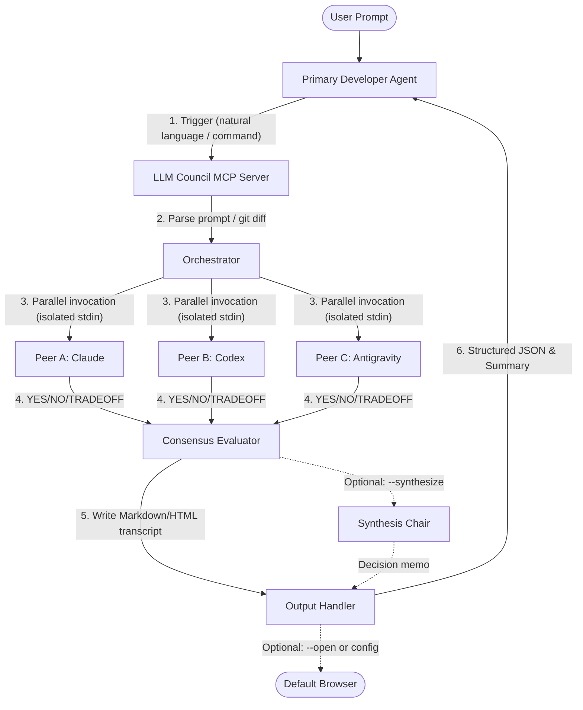

# LLM Council

[](https://github.com/Intellimetrics/llm-council/actions/workflows/test.yml)
[](pyproject.toml)
[](docs/llm-council.md)
[](#read-only-safety)
[](LICENSE)
[](CHANGELOG.md)

Your coding agent grades its own homework. **llm-council** gives it a second opinion that isn't its own: one question or diff, fanned out in parallel to independent, read-only AI peers — the Claude, Codex, and Antigravity CLIs you already have, on your own accounts — and every peer must commit to a verdict: `yes`, `no`, or `tradeoff`. Read-only is enforced by CLI flags, not vibes. Essays without a verdict are rejected.

Runs as an MCP server inside your coding agent, or as a standalone CLI.

## What a run looks like

A real run from this repo's own development. Upstream `mcp` 2.0.0 had just broken fresh installs, we'd shipped a `<2` pin instead of migrating immediately, and we asked the council whether that was the right call. This is the actual output the host agent received:

> **LLM Council** · mode=quick · 3/3 succeeded · run wall=105.2s · recommendation=**yes**
>
> | peer | label | wall time |
> |---|---|---|
> | claude | yes | 105.2s |
> | codex | yes | 89.8s |
> | antigravity | yes | 74.3s |
>
> Transcript: `.llm-council/runs/20260806_123707_….md`

Each peer's response opens with its verdict, backed by evidence the orchestrator mechanically checks against your repo:

```text
RECOMMENDATION: yes - pinning `mcp>=1.0.0,<2` was the right immediate call.
Fresh installs crashing at startup is a severity-critical regression, the pin
is the standard minimal remediation, and the coupling surface in mcp_server.py
is small and well-localized... The pin should carry a deliberate follow-up
ticket, not sit indefinitely.

EVIDENCE:
- [VERIFIED:llm_council/mcp_server.py:991-1035] Progress bridge depends on
  `session.send_progress_notification`, the deepest 1.x internal coupling...
```

Every run also writes paired Markdown, JSON, and HTML transcripts under `.llm-council/runs/`. (This README was itself council-reviewed — unanimous *yes* on "does this need a rewrite" — and rebuilt to the council's blueprint.)

## Quickstart

```bash
# 1. Install (uv)
uv tool install --force git+https://github.com/Intellimetrics/llm-council.git

# 2. Wire it into your project
cd /path/to/your/project
llm-council setup --plan                 # detect what's available, change nothing
llm-council setup --yes --preset auto    # write .llm-council.yaml + .mcp.json
llm-council doctor --probe-native        # verify the peers actually respond
```

> [!IMPORTANT]
> Setup writes host-specific snippets under `.llm-council/instructions/` — it never edits your instruction files for you. Append the active host's snippet to `CLAUDE.md` / `AGENTS.md` / `GEMINI.md` (setup prints the exact paths), then restart that agent session so MCP reloads.

Then just talk to your coding agent:

- *"Ask the council to review my current changes before we commit."*
- *"Take this failing test to council. I need theory and review, not another patch."*
- *"Run a private-local council on this — route it only to my same-machine Ollama."*

Or drive it directly:

```bash
llm-council run --mode review --diff "Is this migration safe to run?"
```

<details>
<summary>pipx install · updating · why not uvx</summary>

```bash
# pipx alternative
pipx install --force git+https://github.com/Intellimetrics/llm-council.git

# update = re-run the install command; check what's newer first with:
llm-council check-update
```

Avoid `uvx` for your primary installation: it's fine for one-off trials but doesn't keep the tool persistently on PATH or give MCP a stable environment. All releases are logged in [CHANGELOG.md](CHANGELOG.md).

</details>

## How it works

llm-council sits between your primary agent and a pool of independent peers. Peers answer in parallel from fresh, isolated contexts; votes are parsed, checked, and reduced to one headline verdict.


```mermaid
graph TD
    User([User Prompt]) --> Agent[Primary Developer Agent]
    Agent -- "1. Trigger (natural language / command)" --> Server[LLM Council MCP Server]
    Server -- "2. Parse prompt / git diff" --> Orchestrator[Orchestrator]
    Orchestrator -- "3. Parallel invocation (isolated stdin)" --> PeerA[Peer A: Claude]
    Orchestrator -- "3. Parallel invocation (isolated stdin)" --> PeerB[Peer B: Codex]
    Orchestrator -- "3. Parallel invocation (isolated stdin)" --> PeerC[Peer C: Antigravity]
    PeerA -- "4. YES/NO/TRADEOFF" --> Consensus[Consensus Evaluator]
    PeerB -- "4. YES/NO/TRADEOFF" --> Consensus
    PeerC -- "4. YES/NO/TRADEOFF" --> Consensus
    Consensus -- "5. Write Markdown/HTML transcript" --> Out[Output Handler]
    Consensus -. "Optional: --synthesize" .-> Synth[Synthesis Chair]
    Synth -. "Decision memo" .-> Out
    Out -. "Optional: --open or config" .-> Browser([Default Browser])
    Out -- "6. Structured JSON & Summary" --> Agent
```

## Why trust it

- **Hard read-only peers.** Native CLI peers run with write tools disabled at the flag level — `--permission-mode manual` (Claude), `--sandbox read-only` (Codex), `--mode plan` (Antigravity). A misbehaving model — or a prompt-injected diff — *cannot* write. [Details.](#read-only-safety)
- **A vote contract, not vibes.** Responses are strictly parsed for `RECOMMENDATION: yes|no|tradeoff`. A peer that rambles without committing is rejected and retried once, then dropped from quorum.
- **Local-CLI-only by default.** Every built-in mode rosters only the native CLIs running under your own accounts. No hosted, per-token-billed peer ever runs unless you explicitly opt in.
- **Cost gates before launch.** Pre-flight token/USD estimation (`llm-council estimate`), a hard `--max-cost-usd` / `--max-tokens` refusal gate, a soft `cost_warn_usd` heads-up, and response caching.
- **Anti-herding deliberation.** When first-round votes disagree, an optional round 2 asks peers to converge on what's *correct* — critique each other, don't capitulate to the group or dig in — mitigating the multi-agent-debate herding failure mode.

<details>
<summary><b>More capabilities</b> — recursion-proofing, secret scanning, synthesis, independence checks, usage telemetry…</summary>

- **Recursion-proof**: a council can never start another council. Every peer subprocess carries a `LLM_COUNCIL_NESTED` marker that makes any nested `council_run` refuse outright, and codex peers boot with an empty MCP server table so a globally registered llm-council can't spawn inside a peer.
- **Credential secret scanning**: prompt content is scanned for API keys, tokens, and private keys, with configurable responses (`warn`, `block`, `redact`, `off`).
- **Assigned-stance review**: `consensus` mode assigns for/against/neutral stances to attack groupthink and sycophancy.
- **Dissent-preserving synthesis** *(opt-in)*: with `--synthesize`, a Synthesis Chair writes a decision memo that attributes blockers to the peers who raised them and names genuine remaining disagreement instead of papering it over.
- **Cross-vendor independence warning** *(opt-in)*: when every labeled vote comes from a single vendor family, the result carries an `independence_warning` so correlated agreement isn't mistaken for independent corroboration.
- **Independent re-review** *(opt-in)*: `--independent-review` suppresses prior-round verdicts on a continuation, so re-reviews aren't anchored to past opinions.
- **Observable per-CLI usage** *(opt-in)*: `usage_from_json` reads real token counts and cost from the Claude/Codex JSON output modes — telemetry that is otherwise invisible for native CLI peers — while preserving the read-only invocation.
- **Host-aware routing**: detects which agent is asking; `quick` includes a fresh instance of the host's own family for a clean-context pass, `peer-only` excludes it.
- **HTML transcript**: every run renders a formatted HTML dashboard; opening it in the browser is opt-in (`--open` or `defaults.auto_open_browser: true`).
- **Loud context accounting**: context files too large to inline are never silently dropped — the result carries a top-level `context_files_dropped` warning, and the transcript header flags it.

</details>

## Built-in modes

All built-in rosters are local-CLI only; hosted peers join only by explicit opt-in.

| Mode | What it does |
| :--- | :--- |
| `quick` | Ask all available native CLI peers (includes a fresh instance of the host's own family for a clean-context pass). |
| `peer-only` | Exclude the host CLI's family — outside perspectives only. |
| `plan` | Independent planning review. |
| `review` | Code/diff review (pair with `--diff`). |
| `review-with-tools` | *Experimental.* CLI peers use their own read-only file/grep tools to verify claims against the repo before voting, instead of relying solely on pasted context. |
| `deliberate` | Adds a second round when first-round votes disagree. |
| `consensus` | Assigned-stance debate (for / against / neutral) to attack groupthink; 2x timeouts. |
| `fable` | Read-only second opinion from Claude Fable 5, with defensive-review framing and a silent-model-substitution guard. |
| `private-local` | Routes only to same-machine loopback Ollama participants. |

## Read-Only Safety

Peers are advisors, not co-authors. How strongly that's enforced differs by peer type — know the difference before reviewing untrusted code:

- **Flag-enforced (hard) — `claude`, `codex`, `antigravity`**: write tools are disabled at the CLI level, so even a prompt-injected diff cannot make a peer write files. The council prompt's read-only directive remains as defense in depth, and `--dangerously-skip-permissions` is deliberately **omitted** for `agy` so residual tool attempts are denied, not auto-approved.
- **Hosted & local models** (OpenRouter / Ollama): plain API calls with no filesystem access at all — inherently read-only.
- **Stdin isolation**: peers receive the codebase or diff via standard input (except `agy`, which stopped reading stdin in 1.1.1 and receives the prompt as a command-line argument instead).

## MCP tools

The server exposes ten tools to your agent. The ones you'll actually see in traffic:

| Tool | What it does |
| :--- | :--- |
| `council_run` | Run a council query with modes, context files, and optional diffs. Returns the verdict, per-peer results, and advisory signals (`cost_warning`, `independence_warning`, `context_files_dropped`). |
| `council_recommend` | Should this task even go to council? Returns a difficulty class, matched trigger keywords, and (optionally) an LLM-graded verdict. |
| `council_estimate` | Token sizes and estimated cost before launching. |
| `council_doctor` | Diagnoses connectivity, API keys, and CLI path resolution. |

<details>
<summary>All ten MCP tools</summary>

| Tool | Description |
| :--- | :--- |
| `council_run` | Run a council query with custom modes, context files, and optional diffs. Supports `open: true`, `independent_review: true`, and `cost_warn_usd`. |
| `council_estimate` | Check token sizes and estimated OpenRouter cost before launching. |
| `council_recommend` | Evaluates a task, risk level, and files touched to recommend whether to consult the council. |
| `council_doctor` | Diagnoses connection issues, API key status, and CLI path resolution. |
| `council_models` | Lists the cached OpenRouter model catalog. |
| `council_list_modes` | Lists configured runtime modes and participants. |
| `council_last_transcript` | Returns the path and content of the last recorded run. |
| `council_stats` | Aggregates participant metrics (runs, success, tokens, cost, quota incidents) across transcripts. |
| `council_query_transcripts` | Searches past transcript history for similar reviews. |
| `council_config` | Get or set `.llm-council.yaml` keys over the MCP connection. |

</details>

## Configuration & presets

`llm-council setup --plan` probes your environment and recommends a preset:

| Preset | Use case |
| :--- | :--- |
| `auto` | Selects `tri-cli` when a Gemini-family CLI and at least one Claude/Codex CLI are available; otherwise `openrouter` when its key is set. |
| `tri-cli` | Native CLI participants from the Claude/Codex families plus Antigravity (the Gemini-family CLI; Google retired the standalone `gemini` CLI for individual accounts in June 2026). |
| `openrouter` | Hosted API models through a single OpenRouter key. |
| `tri-cli-openrouter` | Native CLIs plus hosted OpenRouter participants. |
| `private-local` | Ollama-only; excludes hosted and native CLI participants and makes `private-local` the default mode. |
| `all` | Every discovered participant route on the host machine. |

Custom participants, modes, and defaults live in `.llm-council.yaml`.

`private-local` connects only to an HTTP(S) loopback Ollama endpoint and ignores proxy environment variables for that connection. It does not sandbox the Ollama daemon itself; for a hard offline guarantee, run Ollama with OS/network egress disabled.

<details>
<summary>Advisory knobs (off by default) · deprecated aliases</summary>

These optional keys sharpen the council's signal without changing the read-only guarantee or gating a run. Set under `defaults:` (global) or, where noted, per-mode / per-peer.

| Key | Scope | What it does |
| :--- | :--- | :--- |
| `min_distinct_vendors` / `require_distinct_vendors` | `defaults` / per-mode | Emit an `independence_warning` when fewer than N distinct vendor families produced a labeled vote (never affects quorum or `degraded`). |
| `cost_warn_usd` | `defaults` (or `--cost-warn-usd`) | Attach a non-fatal `cost_warning` when the pre-flight estimate exceeds the threshold; complements the hard `--max-cost-usd` gate. |
| `recommend_judge` | `defaults` | Name a hosted peer to add an LLM difficulty grade to `council_recommend`. Fail-open: any error falls back to the mechanical heuristic. |
| `deliberation_early_stop` | `defaults` / per-mode | In multi-round modes (`max_rounds ≥ 3`), stop deliberating early once a round shows no divergence **and** an unchanged vote tally. |
| `usage_from_json` | per-peer | Invoke `claude` / `codex` in their JSON output modes to record real token usage and cost; fails soft to raw text and keeps the read-only flags. |
| `skip_terse_retry_when_quorum_met` | `defaults` | Default **on**: when a peer times out after the round already has labeled quorum, skip its timeout retry instead of burning more wall time. Set `false` to always retry. |

`litellm` pricing fallback is automatic when the optional `litellm` package is installed — never a hard dependency. Older `local-private` / `local-only` command aliases remain accepted as deprecated; new output uses `private-local`. See `CLAUDE.md` for the full invariant notes behind each knob.

</details>

<details>
<summary><b>CLI reference</b></summary>

| Command | Description / Example |
| :--- | :--- |
| **`llm-council run`** | Run a council query. <br>`llm-council run --mode quick "Why is this test flaky?"` |
| **`llm-council run --diff`** | Review the current git diff. <br>`llm-council run --mode review --diff "Is this migration safe to run?"` |
| **`llm-council run --continue`** | Continue a prior run. A private-local parent stays private-local when mode is omitted; moving its context to hosted/native peers is refused unless `--allow-privacy-downgrade` is explicit. |
| **`llm-council run --independent-review`** | On a `--continue` run, suppress the prior council's verdicts so the round forms its opinion independently. |
| **`llm-council run --cost-warn-usd`** | Non-fatal warning when the pre-flight estimate exceeds a threshold. <br>`llm-council run --mode consensus --cost-warn-usd 0.50 --diff "Worth a full debate?"` |
| **`llm-council estimate`** | Prompt size and cost before running; reports a `cost_class` plus paid/free peer counts. |
| **`llm-council last`** | Inspect the last run's raw transcripts. |
| **`llm-council stats`** | Aggregate per-peer metrics (incl. quota incidents/recoveries) across recorded transcripts. |
| **`llm-council config get/set`** | Read or write configuration values. <br>`llm-council config set defaults.auto_open_browser true` |
| **`llm-council install-hook`** | Install a `pre-commit` or `pre-push` council gate; refuses to replace an existing hook unless `--force`. |
| **`llm-council transcripts prune`** | Preview transcript deletion under a retention policy; add `--delete` to remove. |
| **`llm-council doctor`** | Diagnostics: `--probe-native`, `--probe-openrouter`, `--probe-ollama`, `--check-update`. |

</details>

<details>
<summary><b>Going deeper</b> — single-model councils · manual host wiring</summary>

### Only have one model? Still worth it

1. **Fresh eyes / context separation**: your agent's session context accumulates history and reasoning that breed confirmation bias. Council peers get a fresh, isolated process containing *only* the diff and prompt.
2. **Stance splitting**: concurrent calls to the same model with different stances (attacker / defender / judge) isolate their states; peers see one another's arguments only if deliberation or synthesis is enabled.
3. **Adversarial extraction**: a contrarian stance ("find 3 security flaws in this diff") bypasses the model's default agreeable bias and extracts deeper critique.

### Manual host wiring

`llm-council setup` generates all of these; run it first. Then:

**Claude Code** — install the generated skill:

```bash
cp .llm-council/skills/claude-code/SKILL.md ~/.claude/skills/llm-council/SKILL.md
```

**Codex CLI** — append the generated snippet:

```bash
cat .llm-council/skills/codex-cli/AGENTS.md >> ~/.codex/AGENTS.md
```

**Antigravity CLI** — append the generated snippet:

```bash
cat .llm-council/skills/antigravity/GEMINI.md >> ~/.gemini/GEMINI.md
```

</details>

---

<sub>MIT Licensed. Built to help coding agents ask before they ship.</sub>
